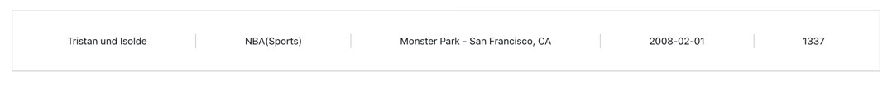

# Note

If you have any issues setting up any part of our test, please let us know so that we can assist.

# Prerequisites

Requires `docker engine 19.03.0+`.

Docker Mac Install: https://hub.docker.com/editions/community/docker-ce-desktop-mac/

Docker Windows Install: https://hub.docker.com/editions/community/docker-ce-desktop-windows/

Docker Linux Install, follow instructions for your dist: https://docs.docker.com/engine/install/

## Setting up the test environment

### Before starting the stack

Requires `java 8+`, `maven 3.6+` and `node 13+`.
Every command assume you are running them from the project root, either in linux or macOS.

Run `cd test-client; npm install`.
Run `cd test-api; mvn clean install`.

### running the stack

#### PostgreSQL

Start PostgreSQL using `start_db.sh` or by running
```shell script
docker run -p 5432:5432 \
          -e POSTGRES_PASSWORD=demopassword \
          -e POSTGRES_USER=demouser \
          -e POSTGRES_DB=demo \
          -v /<absolute path to>/.docker/tickitdb:/data \
          library/postgres:9.6-alpine
```

#### test-api

Once PostgreSQL is running, start `test-api` using `cd test-api; java -jar target/test-api.jar server src/main/resources/config.yml`.
Every new build of `test-api` will require a restart of `test-api`.

#### test-client

Start the client app using `cd test-client; npm start`.
The client app will be available on `http://localhost:3000/`.

## Technical Assignment

In this assignment you will find a skeleton Events ticketing project with a React.js client, a Dropwizard API that communicate with a Postgresql database. 
The db has been Dockerised to make it easy for you to set up.
Your tasks will be to improve upon an existing feature and to implement a new feature.
Provide your best solution and make use of appropriate React, Javascript and Java concepts to optimise and improve the codebase.

### Task One - Improve Feature

This task is to improve existing features and to make any relevant changes to the codebase.

Expected:


1. Add a Cancel button to the Category edit tab, next to the Submit button, returning to the create Category state.
2. Ensure that the Categories list is updated on Category change.
3. Create an Event named “Metal Festival” at Venue “General Motors Place” for next Sunday in a new Category called “Melodic Death Metal”.

### Task Two - Implement new feature

This task is to implement a new feature, creating a new endpoint and displaying the result in the placeholder at the bottom of the page. 
The design can be seen below and it is also included in the repository provided in path: ./task_2_design/design.jpeg.

Expected:

1. Display all details about the most recent event that has the highest number of buyers.


